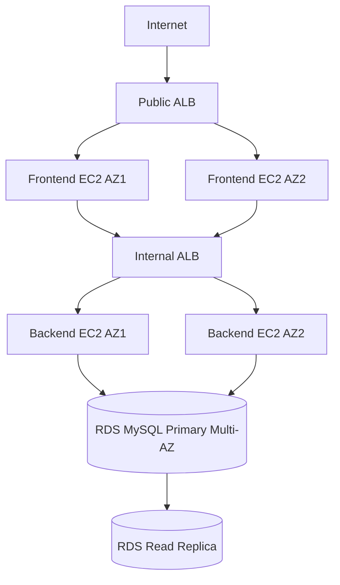

# Book Review App AWS Deployment Report

## Cloud Platform Used

AWS

## Terraform Code Structure

- `versions.tf`: Terraform and provider declarations
- `variables.tf`: Input variables for network, compute, database, and secrets
- `main.tf`: VPC, subnets, route tables, NAT, ALBs, Auto Scaling Groups, and RDS resources
- `outputs.tf`: Public frontend ALB DNS and important service endpoints
- `frontend_user_data.sh.tpl`: Frontend bootstrap and Nginx reverse proxy setup
- `backend_user_data.sh.tpl`: Backend bootstrap and systemd setup

## Architecture Diagram



## Public Load Balancer DNS

Run:

```bash
terraform output frontend_alb_dns
```

## Submission Evidence Checklist

- EC2 dashboard showing frontend and backend instances
- RDS dashboard showing primary plus read replica
- Browser screenshot of the frontend via the public ALB DNS
- Working login/review flow screenshot
- Optional logs from frontend/backend systemd services